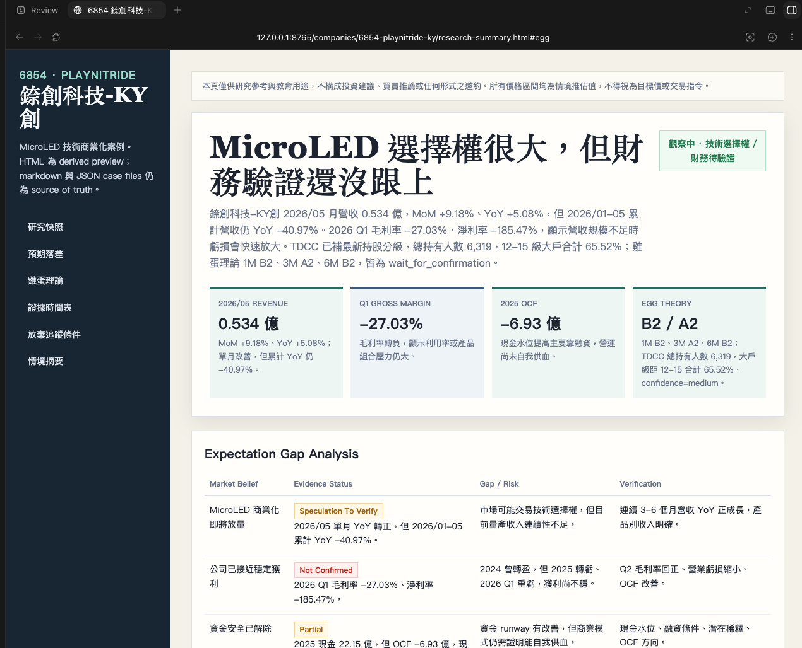

# TW Stock Researcher

> **New here?** Read [`FIRST_RUN.md`](FIRST_RUN.md) first for the quick-start checklist.

## What This Is

This repository is a markdown-first workspace template for researching one stock thesis at a time. It is designed to keep a case persistent across sessions so facts, inference, open questions, signals, and active decisions stay separate and reviewable.

## Core Principles

- Work one stock case at a time.
- Preserve reusable files instead of one-off chat summaries.
- Separate facts, inferences, open questions, and thesis changes.
- Prefer public and free sources unless the user explicitly provides something else.
- Update the case incrementally when new signals arrive.

## Standard Workflow

The canonical order lives in `workflow-contract.json` and is checked against this document by `tests/test_workflow_contract.py`:

```
stock-case-init -> yahoo-profile-financials -> financial-data-fetch -> market-data-fetch -> company-deep-dive -> financial-analysis -> industry-transmission-analysis -> macro-impact-analysis -> market-action-read -> quality-and-valuation-check -> investment-thesis -> session-wrap -> research-html-output
```

1. Start a case with `stock-case-init`.
2. Fetch Yahoo profile + financials with `yahoo-profile-financials`.
3. Fetch the financial-data layer with `financial-data-fetch` (`fetch_fundamentals.py` for the official monthly/quarterly layer, `fetch_goodinfo.py` for the annual fallback).
4. Refresh TDCC and FinMind market data with `market-data-fetch`.
5. Build the company view with `company-deep-dive`.
6. Run financial analysis with `financial-analysis` — a pure consumer of `financial-data-fetch`'s output; it does not fetch data itself.
7. Map industry drivers with `industry-transmission-analysis`.
8. Filter macro variables with `macro-impact-analysis`.
9. Add the market-state layer with `market-action-read`.
10. Add the value-investor quality layer with `quality-and-valuation-check`.
11. Write the current thesis with `investment-thesis`, which reads a current `market-action-read.md` and writes the whole memo once.
12. Use `session-wrap` before ending a session; it is the terminal gate both for a first pass and for a return visit.
13. Use `signal-update` for new filings, revenue releases, or news.
14. Use `case-revisit` when returning to the case later.

## Data Layout

The workspace keeps shared market context under `market/`, reusable templates under `templates/`, and per-stock cases under `companies/`. Create shared market files in `market/` by copying the corresponding templates from `templates/` when needed. See `docs/data-layout.md` for the full layout and file ownership rules.

## Case Storage

Every `companies/<ticker>-<slug>/` case is local, git-ignored session data, not versioned source code — see `docs/case-storage-policy.md` for backup, export, retention, and user-provided position-context handling. Cases must conform to the current contracts; this repository does not migrate earlier shapes.

## Continuous Integration

`.github/workflows/verify.yml` runs `tests/structure/test_skills.sh`, `tests/structure/test_templates.sh`, and the full `unittest` suite on every push and pull request. CI never touches `companies/**`, never requires `FIN_MIND_TOKEN`, and never calls a live network — it only exercises fixtures under `tests/fixtures/`.

## HTML Summary Output

Markdown and JSON files remain the source of truth. When the user explicitly asks for a comprehensive research result as HTML, use the `research-html-output` skill and render a derived preview from `templates/research-html-summary.html`.

The HTML output is produced by string replacement, not by changing the canonical case files:

```bash
.venv/bin/python scripts/render_research_html.py \
  --data companies/<ticker-slug>/research-summary-data.json \
  --output companies/<ticker-slug>/research-summary.html
```

Build the JSON payload from the case files in the same company folder, then let `scripts/render_research_html.py` replace the template placeholders. The HTML output should stay in that company folder as `companies/<ticker-slug>/research-summary.html`. The 6706 惠特 and 6741 91APP preview layouts are represented by the shared template structure: research snapshot, expectation gap, expected evidence timeline, thesis kill criteria, scenario summary, watch items, source quality, and sources.

### Rendered HTML Preview

The screenshot below is the result of rendering a case into HTML with `scripts/render_research_html.py`.



## The Skills

These project-local workflow skills live under `.agents/skills/<skill-name>/SKILL.md`.

- `stock-case-init`: create case metadata, core questions, and initial open questions.
- `yahoo-profile-financials`: run the Yahoo profile and supplemental financial fetch flow.
- `financial-data-fetch`: run `fetch_fundamentals.py` and `fetch_goodinfo.py`; owns all network fetching for the financial-data layer.
- `market-data-fetch`: refresh TDCC ownership distribution and FinMind market data for the requested stock id.
- `company-deep-dive`: analyze business model, products, customers, and revenue structure.
- `financial-analysis`: write the financial fact layer with MOPS cross-checks; a pure consumer of `financial-data-fetch`'s output.
- `industry-transmission-analysis`: map the industry chain and leading indicators.
- `macro-impact-analysis`: keep only macro variables that materially transmit into the case.
- `market-action-read`: summarize market state, institutional flow, and egg-theory evidence without trading instructions; never edits `investment-memo.md`.
- `quality-and-valuation-check`: assess ROIC, owner earnings, working-capital quality, capital allocation, implied expectations, and margin of safety.
- `investment-thesis`: produce the current memo with assumptions and disconfirming evidence; the sole writer of `investment-memo.md`.
- `session-wrap`: preserve unresolved questions, expected evidence, thesis kill criteria, decisions, and next follow-ups; the terminal gate for both first visits and return visits.
- `research-html-output`: render an explicit HTML summary request from `templates/research-html-summary.html` using `scripts/render_research_html.py`; requires a passing `session-wrap` gate.
- `signal-update`: append new events and decide whether the thesis changed.
- `case-revisit`: re-enter an existing case with a file-grounded summary.

## Getting Started

1. Read `FIRST_RUN.md`.
2. Start a new case with `stock-case-init` so metadata, research questions, and open questions are created in the right order.
3. Use the files in `templates/` as the canonical shapes for the artifacts each skill should create or update.
4. Create shared market context files in `market/` by copying the corresponding templates from `templates/` when needed.
5. Run the structure and skill checks in `tests/` after changing the workspace.

## Usage Examples

### Example 1: Researching a new stock

**User:** "幫我分析 3105 穩懋"

**What happens:**
1. `stock-case-init` creates `companies/3105-awsc/` directory
2. `yahoo-profile-financials` runs `scripts/fetch_yahoo.py 3105` → saves `yahoo-data.json` in the case directory
3. `financial-data-fetch` runs `scripts/fetch_fundamentals.py 3105` and `scripts/fetch_goodinfo.py 3105` → saves `fundamentals-data.json` and `raw-data.json` in the case directory
4. `market-data-fetch` runs TDCC then FinMind with `FIN_MIND_TOKEN` when needed → saves `tdcc-data.json` and `market-data.json` in the case directory
5. `company-deep-dive` writes `company-analysis.md` with business model, product mix, margin analysis
6. `financial-analysis` writes `financial-analysis.md` with 3D analysis (經營/獲利/財務健全度) using the already-fetched Goodinfo and FinMind data, plus MOPS cross-check links
7. `industry-transmission-analysis` writes `industry-transmission.md` mapping the industry chain
8. `macro-impact-analysis` writes `macro-map.md` filtering relevant macro variables
9. `market-action-read` writes `market-action-read.md` with 1D/3D/5D price-volume, institutional flow, holder distribution, and egg-theory evidence
10. `quality-and-valuation-check` writes `quality-and-valuation-check.md` with business quality, implied expectations, and margin-of-safety evidence
11. `investment-thesis` reads the current `market-action-read.md` and writes `investment-memo.md` once, with Bull/Base/Bear scenarios using the `investment-reasoning-framework.md` pricing framework
12. `session-wrap` records expected evidence timeline and thesis kill criteria in `active-decisions.md` — the terminal gate for this pass
13. Updates `stock-meta.json` with all file references and stage records

**Files created:**
```
companies/3105-awsc/
├── stock-meta.json          # Case index
├── yahoo-data.json          # Yahoo profile, revenue, margins, and cash-flow summary
├── raw-data.json            # Goodinfo raw financial data
├── fundamentals-data.json   # FinMind monthly revenue, quarterly statements, valuation band
├── tdcc-data.json           # TDCC ownership distribution snapshot
├── research-questions.md    # Core questions & unknowns
├── open-questions.md        # Active open questions
├── active-decisions.md      # Research stance & tracking triggers
├── company-analysis.md      # Business model deep-dive
├── financial-analysis.md    # 3D financial analysis
├── industry-transmission.md # Industry chain & leading indicators
├── macro-map.md            # Macro variables
├── quality-and-valuation-check.md # Quality, implied expectations, margin of safety
├── investment-memo.md      # Investment thesis (dual framework)
├── market-data.json        # FinMind price/volume, institutional, margin, and egg-theory data
├── market-action-read.md   # Neutral market-state read
└── signal-log.md           # Decision history
```

### Example 2: Updating a case with new data

**User:** "更新 2344 華邦電最新財報"

**What happens:**
1. `signal-update` re-runs `financial-data-fetch` (`scripts/fetch_goodinfo.py 2344` and/or `scripts/fetch_fundamentals.py 2344`) to refresh the underlying data
2. Reads existing case files to understand prior thesis
3. Appends the event to `signal-log.md` and updates `thesis-updates.md` if the thesis stance changed
4. Flags `financial-analysis` and, if the thesis stance changed, `investment-thesis` to re-run rather than hand-editing `financial-analysis.md` or `investment-memo.md` itself

### Example 3: Revisiting a case

**User:** "我上次研究的 6789 采鈺現在怎麼樣了？"

**What happens:**
1. `case-revisit` reads `stock-meta.json` to find the case
2. Summarizes current active decisions from `active-decisions.md`
3. Lists open questions from `open-questions.md`
4. Suggests next follow-ups

### Example 4: Comparing peers

**User:** "幫我比較 2330 台積電和 2454 聯發科"

This workspace researches one stock case at a time (see Core Principles); a peer comparison runs the standard workflow independently for each ticker in its own case folder, then compares the two finished cases — it never writes a merged comparison into either case's `financial-analysis.md`.

**What happens:**
1. Runs `stock-case-init` for `2330` and separately for `2454`, creating two independent case folders if they do not already exist
2. Runs the full standard workflow for `2330` end to end (its own `financial-analysis.md`, `quality-and-valuation-check.md`, `investment-memo.md`, etc., all inside `companies/2330-tsmc/`)
3. Runs the full standard workflow for `2454` end to end inside its own `companies/2454-mediatek/` folder
4. Reads both finished cases' `quality-and-valuation-check.md` and `investment-memo.md` and presents a side-by-side comparison directly to the user — this synthesis is not written into either case's files

### Key Conventions

- **Raw data:** Always saved as `companies/{ticker-slug}/raw-data.json`, never in repo root
- **Yahoo data:** Always saved as `companies/{ticker-slug}/yahoo-data.json`, never in repo root
- **Market data:** Always saved as `companies/{ticker-slug}/market-data.json`, never in repo root
- **Financial data:** Goodinfo.tw is the annual primary source; `scripts/fetch_fundamentals.py` adds official monthly revenue, quarterly statements, and the P/E / P/B valuation band (`fundamentals-data.json`); always include MOPS links for cross-checking
- **Macro data:** Taiwan-focused. Run `scripts/fetch_macro.py` to refresh `market/shared-macro-data.json` (TWSE Open API, Yahoo Finance, MOF customs trade statistics by default); include only variables with a concrete company-level transmission path
- **Quality and valuation:** Keep business-quality judgment and implied market expectations in `quality-and-valuation-check.md`; the investment memo should consume its conclusion, not duplicate its tables
- **Expectation gap:** Use `investment-memo.md` to separate market belief, verified evidence, narrative-only claims, and the evidence needed to close or invalidate the gap
- **Market action:** `market-action-read.md` summarizes evidence only; it must not output trade instructions
- **Market data fetch:** run `market-data-fetch` before `market-action-read` when TDCC, FinMind, or egg-theory data is stale
- **Tracking discipline:** Use `active-decisions.md` for expected evidence timelines, thesis kill criteria, and review triggers so a case can be downgraded when evidence stops compounding
- **Thesis format:** Dual framework (Business Thesis + Pricing Thesis per `investment-reasoning-framework.md`)
- **Pricing stages:** Stage 1 (narrative expansion) → Stage 2 (fundamentals catch up) → Stage 3 (growth slows)
- **No unsupported targets:** Never generate price targets without scenario analysis

## What This Is Not

- Not a trading bot.
- Not a valuation engine.
- Not a scheduler or watchlist product.
- Not a source of guaranteed returns, price targets, or trade orders.
