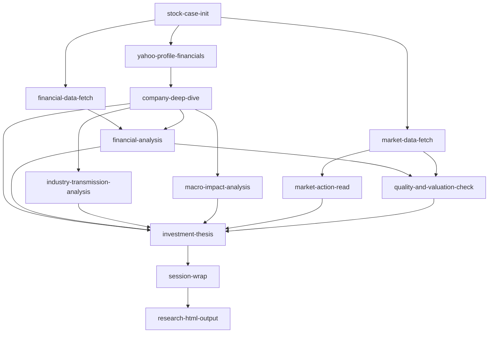

# Stock Research Workflow Contract Hardening Implementation Plan

> **For agentic workers:** REQUIRED SUB-SKILL: Use superpowers:subagent-driven-development (recommended) or superpowers:executing-plans to implement this plan task-by-task. Steps use checkbox (`- [ ]`) syntax for tracking.

**Goal:** Turn the current agent-guided stock-research sequence into a versioned, testable workflow contract with fail-closed data handling, evidence-backed question resolution, official-first source policy, and byte-reproducible HTML output.

**Architecture:** Keep Markdown and JSON case artifacts as the research system of record, but move deterministic rules out of agent prose and into small Python contract modules. A canonical DAG defines stage dependencies and ownership; each fetcher emits the same provenance/status envelope; workflow state records input hashes and invalidates downstream artifacts; agents may write research prose but may not invent workflow state, question closure, render payloads, or HTML fragments.

**Tech Stack:** Python 3 standard library, `unittest`, shell structure tests, JSON contracts, existing `requests`/`beautifulsoup4` fetch stack, static HTML/CSS. Do not add a new runtime dependency in this plan.

## Global Constraints

- Preserve `DISCLAIMER.md` and all no-advice language. No task may add buy/sell, entry/exit, stop-loss, position-size, target-price, or guaranteed-return wording.
- Do not modify or migrate existing `companies/**` artifacts while implementing source code and tests. They are ignored, user-owned session data. Legacy migration is read-only until the user approves an exact target list in a later turn.
- Do not delete root fallback artifacts or any other file without a separately approved exact target list.
- Treat `workflow-contract.json`, not duplicated prose order, as the canonical workflow definition.
- Treat official filing/open-data values as canonical when periods, units, consolidation scope, and restatement status match. Never average conflicting sources.
- A file existing is not evidence of a successful stage. Downstream stages consume only `pass` or explicitly permitted `degraded` inputs.
- Use UTC ISO-8601 timestamps for machine metadata, `Asia/Taipei` only for display, and source observation dates for freshness.
- Rendering must be deterministic: identical normalized inputs plus identical contract/template versions produce byte-identical JSON and HTML.
- All network tests use checked-in fixtures. Unit tests must not call TWSE, TPEx, MOPS, TDCC, FinMind, Yahoo, CBC, or data.gov.tw.
- MOPS XBRL production ingestion is blocked until the legal/technical feasibility gate in Task 10 is resolved. Do not bypass the gate with hidden form posts, cookies, CAPTCHA automation, or browser scraping.
- Commits in this plan are suggestions for the executing agent. Do not push, publish, migrate case data, or open a pull request unless the user separately asks.

## GPT-5.5 Medium Execution Prompt

Use this exact handoff in a later task:

```text
Use superpowers:executing-plans and execute
docs/superpowers/plans/2026-07-10-workflow-contract-hardening.md
task-by-task. Use TDD, preserve all unrelated and ignored case artifacts, and
stop at every explicit decision gate. Do not edit companies/**. Run each task's
focused tests before its commit and run the full verification suite before
claiming completion.
```

## Audit Baseline (2026-07-10)

Current verification is green but semantically incomplete:

```text
sh tests/structure/test_skills.sh                 -> pass
sh tests/structure/test_templates.sh              -> pass
.venv/bin/python -m unittest discover -s tests -p 'test_*.py' -> 69 tests pass
```

Observed repository/case evidence:

- `FIRST_RUN.md:20` omits `market-data-fetch`, although `market-action-read` requires it.
- `AGENTS.md:15-18` runs `investment-thesis` before market data/action, while `templates/investment-memo.md:11-18` requires market-action evidence.
- `templates/quality-and-valuation-check.md:44-58` requires TDCC/current-price inputs before the mandatory workflow fetches them.
- `templates/stock-meta.json:11-23` omits `raw_data`, `fundamentals_data`, `financial_analysis`, `market_data`, and `tdcc_data`.
- Existing cases contain 10 distinct `file_references` key sets and both case-relative and repo-relative path conventions.
- Five per-stock fetchers silently fall back to repo-root output when there are zero or multiple case folders, contradicting repository red lines.
- `templates/open-questions.md` lacks origin stage, evidence references, source-as-of, closure provenance, and reopen conditions; existing case files already show multiple incompatible table shapes.
- The current HTML renderer validates placeholder presence only. It accepts wrong types, raw HTML, wrong table shapes, extra keys, arbitrary output paths, and unversioned payloads.
- Of 18 existing HTML payloads, 4 cannot render with the current template, all 18 lack schema/template/builder/input-manifest versions, and multiple rendered tables have cell counts that disagree with their headers.

## Answers To The Six Audit Questions

### 1. Logic problems

There are seven correctness-level problems, not just style issues:

1. The linear order contradicts actual data dependencies; late market data leaves quality/thesis content stale and a one-row backfill cannot repair scenario logic.
2. `stock-meta.json` is neither a complete artifact index nor workflow state, yet return visits start from it.
3. Fetchers fail open to root paths, allowing a successful exit with data written outside the authoritative case.
4. Required-source failure, optional-source failure, stale data, and complete success are all represented as “file exists plus warnings.”
5. Refreshes do not invalidate dependent analysis, memo, active decisions, or HTML.
6. Open questions have multiple writers and no evidence-backed closure state machine.
7. HTML structure is shared, but data selection, formatting, provenance, and trusted HTML are agent-defined.

### 2. Better data sources

No one free source replaces Goodinfo + FinMind + Yahoo. Use this hierarchy:

| Priority | Source | Canonical role | Important constraint |
| --- | --- | --- | --- |
| 1 | [MOPS](https://mops.twse.com.tw/mops/web/index) filings and iXBRL | Complete statements, notes, audit opinion, restatements, material disclosures | Production automation requires a legal/technical feasibility decision first |
| 1 | [TWSE OpenAPI](https://openapi.twse.com.tw/) | Listed-company master, monthly revenue, IS/BS summaries, governance, price/valuation/flow data | Industry-specific schemas; no complete cash-flow endpoint found |
| 1 | [TPEx OpenAPI](https://www.tpex.org.tw/openapi/) | OTC/emerging equivalent of TWSE official data | Use OpenAPI/data.gov interfaces, not general-site scraping |
| 1 | [TDCC OpenAPI](https://openapi.tdcc.com.tw/swagger-ui/index.html?configUrl=%2Ftdcc-opendata-api-docs%2Fswagger-config) | Weekly ownership distribution | Web history is limited; keep local weekly accumulation and corporate-action caveats |
| 1 | [CBC statistics API](https://cpx.cbc.gov.tw/Data/ExportToAPIInfo) | FX, rates, money and bond series | Persist series code, frequency and revision metadata |
| 1 | [MOF Customs dataset 6053](https://data.gov.tw/dataset/6053), [MOEA industrial production](https://data.gov.tw/dataset/6607), DGBAS/NDC/Energy open data | Company-specific macro/industry transmission | Add only mapped variables; metadata cadence can differ from actual publication cadence |
| 2 | Company IR plus MOPS-uploaded presentations/annual reports | Product, region, customer, capacity and guidance context | Non-standard and selective; numeric claims still reconcile to official filings |
| 2 | [FinMind](https://finmind.github.io/quickstart/) | Normalized historical cache and fallback | Third-party limits/maintenance/terms; core values need official reconciliation |
| 3 | Goodinfo | Temporary annual cross-check/fallback | HTML scraper, no stable API/schema/SLA |
| 3 | Yahoo Finance | Local discovery/profile/commodity fallback | Non-canonical and unsuitable as the default source for shareable HTML |
| Paid, later | [TWSE Data E-Shop](https://eshop.twse.com.tw/zh/mops/list) | Contractual bulk delivery when scale or redistribution justifies cost | Not economical for one-stock-at-a-time local research |

Immediate source change: route market/company type from `stock-meta.json`; add TWSE/TPEx official adapters; move TDCC to its documented OpenAPI; keep FinMind for normalized history/cash-flow fallback; demote Goodinfo/Yahoo. Do not claim “official three statements” until MOPS/XBRL coverage is proven.

### 3. Workflow optimizations

Replace the linear list with this DAG:



The three fetch branches may run concurrently after case initialization. Analysis keeps one writer per output. `market-action-read` no longer edits `investment-memo.md`; `investment-thesis` consumes the completed market read. `session-wrap` is the terminal gate for both first visits and return visits.

### 4. Open questions resolved during workflow

Yes, deterministic and public-disclosure questions should be resolved at their owning stage. Not every uncertainty should disappear.

Auto-resolvable families:

- Case identity, market/suffix, path uniqueness and file coverage.
- Three-statement coverage, latest monthly-revenue period, valuation-band availability.
- Price-history length, TDCC snapshot count, market-data window coverage.
- Insider holdings/pledges/transfers, 10% shareholders and disclosed related-party/loan/guarantee fields.
- Macro series freshness when a company-to-series registry exists.

Evidence-gated, partly automated families:

- Segment mix, debt maturity, allowance, contract liabilities and related-party details from filings/notes.
- Industry transmission and customer/product claims from filings/IR.

Questions that remain open by design:

- Information not publicly disclosed.
- Claims requiring a future filing/event.
- User-only context.
- Causal judgments, moat durability and scenario uncertainty.

Closure requires `evidence reference + source as-of + resolver stage + resolution + closed date + reopen trigger`. “An agent wrote an answer” is not a closure condition.

### 5. Consistent HTML across agents

Guarantee two different properties separately:

- **Structural/byte consistency:** fully solvable. Agents never build placeholder JSON or HTML. A deterministic builder reads fixed source headings/tables into a versioned typed payload; a safe renderer creates all tags, formatting and ordering.
- **Research judgment consistency:** only solvable when the canonical upstream files expose structured fields. Add fixed pricing-stage, stance, scenario, timeline and question tables; extract their exact values instead of asking each rendering agent to re-summarize prose.

Required invariant:

```text
same source-file bytes + same source metadata + same contract version
+ same template version = same payload SHA-256 + same HTML SHA-256
```

### 6. Additional indicators

First make existing promised metrics deterministic: incremental ROIC, DSO/DIO/DPO, interest coverage, dilution, owner earnings and cash conversion currently appear in templates but are not consistently derived by code.

Then add these evidence families, without composite buy/sell scores:

| Metric family | Formula / rule | Invalidity rule |
| --- | --- | --- |
| Cash-flow accrual | `(TTM net income - TTM CFO) / average total assets` | Missing CFO/assets => unavailable; do not substitute EBITDA |
| Three-year incremental ROIC | `(NOPAT_t - NOPAT_t-3) / sum(Capex - D&A + change in NOWC)` | Non-positive or immaterial denominator => not meaningful |
| Debt-service capacity | `net debt / TTM EBITDA` and `TTM EBIT / abs(interest expense)` | EBITDA <= 0 => net-debt ratio not meaningful |
| Dilution-adjusted compounding | CAGR of `owner earnings / diluted weighted-average shares`, plus diluted-share CAGR | Missing comparable diluted shares => unavailable |
| Governance/disclosure vector | pledge ratio, 90-day pre-announced transfers, modified audit opinion, restatement and penalty flags | Do not collapse correlated flags into a score |
| Normalized short pressure | `(short balance + securities-lending sold balance) / free-float shares`; days-to-cover versus 20-day median volume | Borrowed shares are not automatically short; insufficient free float => unavailable |
| Sector-relative total return | 63/126-day corporate-action-adjusted stock return minus sector return | Unadjusted prices must be labeled price return, not total return |
| TDCC concentration change | Predeclared large-holder custody share change over 4/13 weeks | Adjust capital actions; do not call bucket data HHI or infer named holders |
| Source/data quality | completeness, freshness, source tier, period/unit/scope match and reconciliation state | Never average conflicts; block or degrade explicitly |

Do not implement free analyst-consensus revisions, a universal ESG score, reverse DCF, or macro regression in the first hardening release. Reverse DCF and elasticity require separate model-risk review after source/period contracts are reliable.

## Target File Responsibilities

| File | Responsibility |
| --- | --- |
| `workflow-contract.json` | Canonical DAG, stage ownership, statuses, required/optional inputs, question namespaces |
| `scripts/case_paths.py` | Unique case resolution and safe repo-relative paths |
| `scripts/data_contract.py` | Fetch metadata/status/provenance envelope and atomic JSON writes |
| `scripts/workflow_state.py` | Preflight, stage gate, record, input hashes and downstream invalidation |
| `scripts/markdown_contract.py` | Strict fixed-heading/table parsing used by questions and HTML builder |
| `scripts/open_questions.py` | Validate/upsert/resolve the canonical Markdown question ledger |
| `scripts/research_summary_contract.py` | Typed render payload, validation, canonical JSON and formatting |
| `scripts/build_research_summary.py` | Deterministic case-files-to-payload source map |
| `scripts/render_research_html.py` | Typed payload-to-safe-HTML renderer with fixed paths and atomic writes |
| `scripts/validate_research_summary.py` | Read-only legacy/readiness audit |
| `scripts/fetch_official_issuer.py` | TWSE/TPEx official issuer/monthly/IS/BS/governance adapter |
| `scripts/reconcile_sources.py` | Period/unit/scope-aware source comparison and conflict classification |
| `scripts/metrics/financial_quality.py` | Deterministic financial-quality metric families |
| `scripts/metrics/market_confirmation.py` | Normalized market/ownership metric families |
| `docs/source-policy.md` | Source hierarchy, licensing/distribution scope and conflict rules |
| `docs/case-storage-policy.md` | Local/private ignored-case durability, backup/export and sensitive context policy |

---

### Task 1: Add the canonical workflow contract and semantic contract tests

**Files:**

- Create: `workflow-contract.json`
- Create: `docs/workflow-contract.md`
- Create: `tests/test_workflow_contract.py`
- Modify: `tests/structure/test_skills.sh`

**Interfaces:**

- Consumes: current skill names and file ownership rules from `AGENTS.md` and `docs/data-layout.md`.
- Produces: `load_contract(path: Path) -> dict`, `topological_order(contract: dict) -> list[str]`, and a canonical stage definition used by Tasks 4-9.

- [ ] **Step 1: Write failing semantic tests**

Add tests that assert:

```python
EXPECTED_ORDER_CONSTRAINTS = {
    "company-deep-dive": {"yahoo-profile-financials"},
    "financial-analysis": {"company-deep-dive", "financial-data-fetch"},
    "market-action-read": {"market-data-fetch"},
    "quality-and-valuation-check": {"financial-analysis", "market-data-fetch"},
    "investment-thesis": {
        "company-deep-dive",
        "financial-analysis",
        "industry-transmission-analysis",
        "macro-impact-analysis",
        "quality-and-valuation-check",
        "market-action-read",
    },
    "session-wrap": {"investment-thesis"},
    "research-html-output": {"session-wrap"},
}

def test_every_output_has_one_owner(self):
    owners = {}
    for stage in self.contract["stages"]:
        for output in stage["outputs"]:
            self.assertNotIn(output, owners, f"duplicate owner for {output}")
            owners[output] = stage["id"]

def test_terminal_stage_is_session_wrap(self):
    self.assertEqual(self.contract["terminal_stage"], "session-wrap")
```

- [ ] **Step 2: Run the focused test and confirm it fails**

Run:

```bash
.venv/bin/python -m unittest tests.test_workflow_contract -v
```

Expected: failure because `workflow-contract.json` and `financial-data-fetch` do not exist.

- [ ] **Step 3: Create the exact contract**

Use this top-level shape and status vocabulary:

```json
{
  "schema_version": 1,
  "terminal_stage": "session-wrap",
  "stage_statuses": ["pending", "running", "pass", "degraded", "blocked", "stale", "failed"],
  "consumable_statuses": ["pass", "degraded"],
  "stages": [
    {"id": "stock-case-init", "depends_on": [], "required_inputs": [], "optional_inputs": [], "outputs": ["stock-meta.json", "research-questions.md", "open-questions.md"], "question_namespace": "CASE"},
    {"id": "yahoo-profile-financials", "depends_on": ["stock-case-init"], "required_inputs": ["stock-meta.json"], "optional_inputs": [], "outputs": ["yahoo-data.json"], "question_namespace": "PROFILE"},
    {"id": "financial-data-fetch", "depends_on": ["stock-case-init"], "required_inputs": ["stock-meta.json"], "optional_inputs": ["yahoo-data.json"], "outputs": ["official-issuer-data.json", "raw-data.json", "fundamentals-data.json"], "question_namespace": "FIN-DATA"},
    {"id": "market-data-fetch", "depends_on": ["stock-case-init"], "required_inputs": ["stock-meta.json"], "optional_inputs": [], "outputs": ["tdcc-data.json", "market-data.json"], "question_namespace": "MKT-DATA"},
    {"id": "company-deep-dive", "depends_on": ["yahoo-profile-financials"], "required_inputs": ["stock-meta.json", "yahoo-data.json"], "optional_inputs": ["official-issuer-data.json"], "outputs": ["company-analysis.md"], "question_namespace": "COMPANY"},
    {"id": "financial-analysis", "depends_on": ["company-deep-dive", "financial-data-fetch"], "required_inputs": ["company-analysis.md", "fundamentals-data.json"], "optional_inputs": ["official-issuer-data.json", "raw-data.json", "yahoo-data.json"], "outputs": ["financial-analysis.md"], "question_namespace": "FIN"},
    {"id": "industry-transmission-analysis", "depends_on": ["company-deep-dive"], "required_inputs": ["company-analysis.md"], "optional_inputs": ["official-issuer-data.json"], "outputs": ["industry-transmission.md"], "question_namespace": "IND"},
    {"id": "macro-impact-analysis", "depends_on": ["company-deep-dive"], "required_inputs": ["company-analysis.md"], "optional_inputs": ["market/shared-macro-data.json"], "outputs": ["macro-map.md"], "question_namespace": "MAC"},
    {"id": "market-action-read", "depends_on": ["market-data-fetch"], "required_inputs": ["market-data.json"], "optional_inputs": ["tdcc-data.json"], "outputs": ["market-action-read.md"], "question_namespace": "MKT"},
    {"id": "quality-and-valuation-check", "depends_on": ["financial-analysis", "market-data-fetch"], "required_inputs": ["financial-analysis.md", "fundamentals-data.json", "market-data.json"], "optional_inputs": ["tdcc-data.json", "official-issuer-data.json"], "outputs": ["quality-and-valuation-check.md"], "question_namespace": "QUAL"},
    {"id": "investment-thesis", "depends_on": ["company-deep-dive", "financial-analysis", "industry-transmission-analysis", "macro-impact-analysis", "quality-and-valuation-check", "market-action-read"], "required_inputs": ["company-analysis.md", "financial-analysis.md", "industry-transmission.md", "macro-map.md", "quality-and-valuation-check.md", "market-action-read.md"], "optional_inputs": [], "outputs": ["investment-memo.md"], "question_namespace": "THESIS"},
    {"id": "session-wrap", "depends_on": ["investment-thesis"], "required_inputs": ["investment-memo.md", "open-questions.md"], "optional_inputs": ["signal-log.md", "thesis-updates.md"], "outputs": ["active-decisions.md"], "question_namespace": "WRAP"},
    {"id": "research-html-output", "depends_on": ["session-wrap"], "required_inputs": ["investment-memo.md", "active-decisions.md", "open-questions.md", "quality-and-valuation-check.md", "market-action-read.md"], "optional_inputs": ["tdcc-data.json"], "outputs": ["research-summary-data.json", "research-summary.html"], "question_namespace": "HTML"}
  ]
}
```

Document that `degraded` is consumable only when the consuming stage explicitly allows the missing optional evidence; `blocked`, `stale`, and `failed` never are.

- [ ] **Step 4: Make the structure test read the contract instead of maintaining another order list**

Keep the existence/frontmatter checks, but obtain skill names from the JSON contract. Do not duplicate a shell `skills=` list.

- [ ] **Step 5: Run focused verification**

Run:

```bash
.venv/bin/python -m unittest tests.test_workflow_contract -v
sh tests/structure/test_skills.sh
```

Expected: pass.

- [ ] **Step 6: Commit**

```bash
git add workflow-contract.json docs/workflow-contract.md tests/test_workflow_contract.py tests/structure/test_skills.sh
git commit -m "feat: define canonical research workflow contract"
```

### Task 2: Fail closed when resolving case folders and output paths

**Files:**

- Create: `scripts/case_paths.py`
- Create: `tests/test_case_paths.py`
- Modify: `scripts/fetch_yahoo.py`
- Modify: `scripts/fetch_goodinfo.py`
- Modify: `scripts/fetch_fundamentals.py`
- Modify: `scripts/fetch_finmind.py`
- Modify: `scripts/fetch_tdcc.py`
- Modify: `tests/test_fetch_yahoo.py`
- Modify: `tests/test_fetch_goodinfo.py`
- Modify: `tests/test_fetch_fundamentals.py`
- Modify: `tests/test_fetch_finmind.py`
- Modify: `tests/test_fetch_tdcc.py`

**Interfaces:**

- Consumes: stock id, repository root, optional explicit output.
- Produces:

- `CaseResolutionError`, a `RuntimeError` subclass.
- `resolve_case_dir(stock_id: str, repo_root: Path) -> Path`.
- `case_output_path(stock_id: str, filename: str, repo_root: Path) -> Path`.
- `validate_explicit_output(output: Path, repo_root: Path) -> Path`.

- [ ] **Step 1: Replace fallback-success tests with failing-path tests**

Cover zero matches, two matches, one match, path escape, and explicit output. The business invariant is: implicit output requires exactly one case; an explicit output is allowed only when the CLI flag was supplied and the resolved path remains inside the repository.

- [ ] **Step 2: Run tests and confirm current fallback behavior fails the new assertions**

Run:

```bash
.venv/bin/python -m unittest tests.test_case_paths tests.test_fetch_yahoo tests.test_fetch_fundamentals tests.test_fetch_finmind tests.test_fetch_tdcc -v
```

Expected: failures where current code returns repo-root fallback names.

- [ ] **Step 3: Implement the shared resolver**

Use this complete behavior:

```python
from pathlib import Path


class CaseResolutionError(RuntimeError):
    pass


def _root(path: Path) -> Path:
    return path.resolve()


def resolve_case_dir(stock_id: str, repo_root: Path) -> Path:
    if not stock_id.isdigit():
        raise CaseResolutionError(f"invalid Taiwan stock id: {stock_id!r}")
    root = _root(repo_root)
    matches = sorted(
        path.resolve()
        for path in (root / "companies").glob(f"{stock_id}-*")
        if path.is_dir()
    )
    if len(matches) != 1:
        names = ", ".join(path.name for path in matches) or "none"
        raise CaseResolutionError(
            f"expected exactly one companies/{stock_id}-*/ directory; found {len(matches)}: {names}"
        )
    return matches[0]


def case_output_path(stock_id: str, filename: str, repo_root: Path) -> Path:
    if Path(filename).name != filename:
        raise CaseResolutionError(f"output filename must not contain a path: {filename!r}")
    return resolve_case_dir(stock_id, repo_root) / filename


def validate_explicit_output(output: Path, repo_root: Path) -> Path:
    root = _root(repo_root)
    resolved = output.resolve()
    if resolved != root and root not in resolved.parents:
        raise CaseResolutionError(f"explicit output escapes repository: {resolved}")
    return resolved
```

- [ ] **Step 4: Route all five fetchers through the shared resolver**

Delete their duplicated default-path functions. Preserve explicit output CLI compatibility, but call `validate_explicit_output` before writing. Print the case-resolution error to stderr and return a non-zero exit code.

- [ ] **Step 5: Run focused and full tests**

Run:

```bash
.venv/bin/python -m unittest tests.test_case_paths tests.test_fetch_yahoo tests.test_fetch_goodinfo tests.test_fetch_fundamentals tests.test_fetch_finmind tests.test_fetch_tdcc -v
.venv/bin/python -m unittest discover -s tests -p 'test_*.py'
```

Expected: pass; no test expects a repo-root fallback.

- [ ] **Step 6: Commit**

```bash
git add scripts/case_paths.py scripts/fetch_yahoo.py scripts/fetch_goodinfo.py scripts/fetch_fundamentals.py scripts/fetch_finmind.py scripts/fetch_tdcc.py tests/test_case_paths.py tests/test_fetch_yahoo.py tests/test_fetch_goodinfo.py tests/test_fetch_fundamentals.py tests/test_fetch_finmind.py tests/test_fetch_tdcc.py
git commit -m "fix: fail closed on ambiguous stock case paths"
```

### Task 3: Normalize fetch status, provenance and freshness metadata

**Files:**

- Create: `scripts/data_contract.py`
- Create: `tests/test_data_contract.py`
- Modify: all six `scripts/fetch_*.py` data fetchers
- Modify: all six corresponding unit-test files

**Interfaces:**

- Produces:

- Constants `STATUS_PASS = "pass"`, `STATUS_DEGRADED = "degraded"`, and `STATUS_BLOCKED = "blocked"`.
- `classify_status(required_counts: dict[str, int], optional_counts: dict[str, int], errors: list[dict]) -> str`.
- `metadata_envelope(*, status: str, fetched_at: datetime, source_as_of: str | None, expected_source_as_of: str | None, requested_range: dict, observed_range: dict, required_datasets: list[str], optional_datasets: list[str], row_counts: dict[str, int], source_urls: dict[str, str], source_tiers: dict[str, str], license_ids: dict[str, str], warnings: list[dict], errors: list[dict], parser_version: str) -> dict`.
- `atomic_write_json(path: Path, payload: dict) -> None`.
- `latest_observation_date(rows: list[dict], field: str = "date") -> str | None`.

- [ ] **Step 1: Write failing contract tests**

Required-empty must be `blocked`; optional-empty must be `degraded`; all required/optional present must be `pass`; `fetched_at` must end in `Z`; `source_as_of` must come from data, not wall-clock time; atomic failure must leave the previous target unchanged.

- [ ] **Step 2: Implement the shared envelope**

Every fetch output gets this exact metadata shape:

```json
{
  "schema_version": 2,
  "status": "pass",
  "fetched_at": "2026-07-10T00:00:00Z",
  "source_as_of": "2026-07-09",
  "expected_source_as_of": "2026-07-09",
  "requested_range": {"start": null, "end": null},
  "observed_range": {"start": "2026-01-01", "end": "2026-07-09"},
  "required_datasets": [],
  "optional_datasets": [],
  "row_counts": {},
  "source_urls": {},
  "source_tiers": {},
  "license_ids": {},
  "warnings": [],
  "errors": [],
  "parser_version": "2"
}
```

Warnings/errors are objects with `code`, `dataset`, and `message`; never mix strings and objects. `expected_source_as_of` is supplied by the dataset adapter or left `null`, producing unknown freshness rather than a guessed fresh result.

- [ ] **Step 3: Implement atomic JSON writing**

Serialize with `ensure_ascii=False`, `sort_keys=True`, two-space indent and a trailing newline. Write a same-directory temporary file, flush/fsync it, then `os.replace`. Clean the temporary file on failure.

- [ ] **Step 4: Convert each fetcher**

Rules:

- Yahoo profile identity is required; supplemental statements are optional.
- Financial data requires a usable official/normalized recent layer; Goodinfo becomes optional fallback after Task 9.
- Market data requires price and institutional rows; TDCC, holding-shares-per, margin and day trading remain optional.
- TDCC requires a non-empty requested stock snapshot.
- Macro may be `degraded` when one source fails but at least one included variable remains; all sources empty is `blocked`.
- A blocked fetch may write diagnostic JSON, but its CLI exits `2`; degraded/pass exit `0`; runtime failure exits `1`.

- [ ] **Step 5: Add fixed-date freshness tests**

Inject `as_of` into pure helper calls. Cover: today’s fetch containing old observations; a weekly TDCC observation; monthly revenue before/after expected release; an empty API response; and a source restatement with the same period but a newer filing id.

- [ ] **Step 6: Verify**

Run:

```bash
.venv/bin/python -m unittest tests.test_data_contract -v
.venv/bin/python -m unittest discover -s tests -p 'test_*.py'
```

Expected: pass.

- [ ] **Step 7: Commit**

```bash
git add scripts/data_contract.py scripts/fetch_yahoo.py scripts/fetch_goodinfo.py scripts/fetch_fundamentals.py scripts/fetch_finmind.py scripts/fetch_tdcc.py scripts/fetch_macro.py tests/test_data_contract.py tests/test_fetch_yahoo.py tests/test_fetch_goodinfo.py tests/test_fetch_fundamentals.py tests/test_fetch_finmind.py tests/test_fetch_tdcc.py tests/test_fetch_macro.py
git commit -m "feat: standardize fetch provenance and status"
```

### Task 4: Make `stock-meta.json` a deterministic stage manifest with invalidation

**Files:**

- Modify: `templates/stock-meta.json`
- Create: `scripts/workflow_state.py`
- Create: `tests/test_workflow_state.py`
- Create: `tests/fixtures/cases/workflow-valid/`
- Create: `tests/fixtures/cases/workflow-stale/`
- Modify: `docs/data-layout.md`

**Interfaces:**

```bash
.venv/bin/python scripts/workflow_state.py preflight tests/fixtures/cases/workflow-valid --json
.venv/bin/python scripts/workflow_state.py gate tests/fixtures/cases/workflow-valid investment-thesis --as-of 2026-07-10 --json
.venv/bin/python scripts/workflow_state.py record tests/fixtures/cases/workflow-valid financial-analysis
.venv/bin/python scripts/workflow_state.py status tests/fixtures/cases/workflow-valid --json
```

Python API:

- `hash_file(path: Path) -> str`.
- `gate_stage(case_dir: Path, stage_id: str, contract: dict, as_of: date) -> dict`.
- `record_stage(case_dir: Path, stage_id: str, contract: dict) -> dict`.
- `invalidate_downstream(meta: dict, changed_stage: str, contract: dict) -> list[str]`.

- [ ] **Step 1: Write failing workflow-state tests**

Assert complete file references, repo-relative paths only, unique stage ids, input hashes, downstream invalidation, required stale/blocked rejection, optional degraded acceptance, and no completion without `session-wrap`.

- [ ] **Step 2: Expand the metadata template**

Add references for every core artifact, including `official_issuer_data`, `raw_data`, `fundamentals_data`, `financial_analysis`, `market_data`, `tdcc_data`, `research_summary_data`, and `research_summary_html`. Add:

```json
{
  "workflow_contract_version": 1,
  "stage_records": {}
}
```

Each stage record contains `status`, `checked_at`, `source_as_of`, `input_hashes`, `output_hashes`, and `issues`. Do not store absolute paths.

- [ ] **Step 3: Implement read-only preflight and gate commands**

`preflight`, `gate`, and `status` never write. `record` is the only command that updates `stock-meta.json`, and it uses `atomic_write_json`.

- [ ] **Step 4: Implement downstream invalidation**

Compare current required-input hashes with recorded hashes. If an upstream output changes, mark every transitive consumer `stale`; do not delete or rewrite their artifacts.

- [ ] **Step 5: Verify**

Run:

```bash
.venv/bin/python -m unittest tests.test_workflow_state -v
.venv/bin/python scripts/workflow_state.py status tests/fixtures/cases/workflow-valid --json
```

Expected: tests pass; the fixture reports a complete, current path through `session-wrap`.

- [ ] **Step 6: Commit**

```bash
git add templates/stock-meta.json scripts/workflow_state.py tests/test_workflow_state.py tests/fixtures/cases/workflow-valid tests/fixtures/cases/workflow-stale docs/data-layout.md
git commit -m "feat: track workflow state and downstream staleness"
```

### Task 5: Create one evidence-backed open-question ledger

**Files:**

- Create: `scripts/markdown_contract.py`
- Create: `scripts/open_questions.py`
- Modify: `templates/open-questions.md`
- Modify: `templates/research-questions.md`
- Create: `tests/test_markdown_contract.py`
- Create: `tests/test_open_questions.py`
- Create: `tests/fixtures/open-questions/valid.md`
- Create: `tests/fixtures/open-questions/invalid-closure.md`

**Interfaces:**

```bash
.venv/bin/python scripts/open_questions.py validate tests/fixtures/open-questions/valid.md
.venv/bin/python scripts/open_questions.py upsert tests/fixtures/cases/workflow-valid --id FIN-DATA-VALUATION --stage financial-data-fetch --priority high --question "Is the valuation band complete?" --resolve-when "valuation_band.status == ready" --next-check "fetch_fundamentals.py"
.venv/bin/python scripts/open_questions.py resolve tests/fixtures/cases/workflow-valid --id FIN-DATA-VALUATION --stage financial-data-fetch --evidence "fundamentals-data.json#/derived/valuation_band" --as-of 2026-07-09 --resolution "Official valuation-band inputs are present." --reopen-trigger "source period or filing id changes"
```

- [ ] **Step 1: Replace the template with the canonical active and resolved tables**

Active columns:

```text
ID | Origin Stage | Priority | Status | Blocking Stage | Question | Why It Matters | Resolve When | Evidence Refs | Next Check | Last Checked
```

Resolved columns:

```text
ID | Resolution | Evidence Refs | Evidence As Of | Resolved By Stage | Closed On | Reopen Trigger
```

Statuses: `open`, `waiting_external`, `blocked`, `resolved`, `superseded`. The critical question is a stable ID reference to the active table, not a duplicated question row.

- [ ] **Step 2: Write failing validation tests**

Reject duplicate ids, unknown namespaces/statuses, owner changes, missing resolution evidence, missing source-as-of, missing reopen trigger, and `session-wrap` as a resolver.

- [ ] **Step 3: Implement the strict Markdown parser and ledger commands**

Use fixed headings/headers; normalize Unicode NFC/newlines; preserve deterministic row order by priority then ID. Do not introduce a duplicate JSON source of truth.

- [ ] **Step 4: Implement deterministic resolver hooks**

Add pure resolvers for:

- `three_statement_coverage.required_missing`
- latest monthly-revenue period and row count
- valuation-band readiness
- market price rows for 5-day windows
- 120-row market history for 6-month reads
- TDCC history length
- macro included-variable source/as-of/cadence

These resolvers may close only their own namespace and only when the evidence predicate is true.

- [ ] **Step 5: Verify**

Run:

```bash
.venv/bin/python -m unittest tests.test_markdown_contract tests.test_open_questions -v
.venv/bin/python scripts/open_questions.py validate tests/fixtures/open-questions/valid.md
```

Expected: pass.

- [ ] **Step 6: Commit**

```bash
git add scripts/markdown_contract.py scripts/open_questions.py templates/open-questions.md templates/research-questions.md tests/test_markdown_contract.py tests/test_open_questions.py tests/fixtures/open-questions
git commit -m "feat: enforce evidence-backed question lifecycle"
```

### Task 6: Reorder skills around the DAG and enforce one writer per artifact

**Files:**

- Create: `.agents/skills/financial-data-fetch/SKILL.md`
- Modify: all workflow `.agents/skills/*/SKILL.md` files named in `workflow-contract.json`
- Modify: `AGENTS.md`
- Modify: `README.md`
- Modify: `FIRST_RUN.md`
- Modify: `docs/data-layout.md`
- Modify: `tests/structure/test_templates.sh`
- Modify: `tests/structure/test_skills.sh`
- Modify: `tests/test_workflow_contract.py`

**Interfaces:**

- Consumes: Tasks 1, 4 and 5 contract commands.
- Produces: every skill follows `preflight -> work -> gate -> record -> question transition`; all docs show the same DAG.

- [ ] **Step 1: Add the financial-data-fetch skill**

It runs the official issuer adapter, fundamentals fetcher and temporary Goodinfo fallback, then records status. Remove network fetching from `financial-analysis`; that skill becomes a pure consumer of current data artifacts.

- [ ] **Step 2: Remove the market-action memo backfill**

Delete `.agents/skills/market-action-read/SKILL.md` ownership of the memo row. `investment-thesis` must read a current `market-action-read.md` and write the whole memo once.

- [ ] **Step 3: Make session-wrap terminal on first and return visits**

Document return flow as:

```text
case-revisit -> affected stages -> invalidated downstream stages -> session-wrap
```

HTML requires a passing `session-wrap` gate. Missing `active-decisions.md` is an explicit readiness error, not a fallback opportunity.

- [ ] **Step 4: Make every skill use the same lifecycle**

Add exact commands to each skill for preflight/gate/record. Stages may upsert/resolve only their question namespace. `case-revisit` and `session-wrap` reconcile/report but may not close questions without an owning resolver.

- [ ] **Step 5: Replace duplicated prose order with a generated/reference block**

Keep a human-readable DAG in `AGENTS.md`, `README.md`, and `FIRST_RUN.md`, but semantic tests must compare every listed stage/edge to `workflow-contract.json`. Fix README examples that omit `fetch_fundamentals.py` and the one-stock-at-a-time conflict in the peer-comparison example.

- [ ] **Step 6: Verify**

Run:

```bash
sh tests/structure/test_skills.sh
sh tests/structure/test_templates.sh
.venv/bin/python -m unittest tests.test_workflow_contract -v
```

Expected: pass and no stage has two output owners.

- [ ] **Step 7: Commit**

```bash
git add .agents/skills/financial-data-fetch/SKILL.md .agents/skills/stock-case-init/SKILL.md .agents/skills/yahoo-profile-financials/SKILL.md .agents/skills/company-deep-dive/SKILL.md .agents/skills/financial-analysis/SKILL.md .agents/skills/industry-transmission-analysis/SKILL.md .agents/skills/macro-impact-analysis/SKILL.md .agents/skills/market-data-fetch/SKILL.md .agents/skills/market-action-read/SKILL.md .agents/skills/quality-and-valuation-check/SKILL.md .agents/skills/investment-thesis/SKILL.md .agents/skills/signal-update/SKILL.md .agents/skills/case-revisit/SKILL.md .agents/skills/session-wrap/SKILL.md .agents/skills/research-html-output/SKILL.md AGENTS.md README.md FIRST_RUN.md docs/data-layout.md tests/structure/test_templates.sh tests/structure/test_skills.sh tests/test_workflow_contract.py
git commit -m "refactor: align agent skills with workflow DAG"
```

### Task 7: Build a typed, deterministic and safe HTML pipeline

**Files:**

- Modify: `templates/active-decisions.md`
- Modify: `templates/investment-memo.md`
- Modify: `templates/research-html-summary.html`
- Create: `templates/research-summary-data.schema.json`
- Create: `scripts/research_summary_contract.py`
- Create: `scripts/build_research_summary.py`
- Rewrite: `scripts/render_research_html.py`
- Create: `scripts/validate_research_summary.py`
- Modify: `.agents/skills/research-html-output/SKILL.md`
- Modify: `AGENTS.md`
- Modify: `docs/data-layout.md`
- Modify: `templates/stock-meta.json`
- Create: `tests/test_research_summary_contract.py`
- Create: `tests/test_build_research_summary.py`
- Rewrite: `tests/test_render_research_html.py`
- Create: `tests/fixtures/research-summary-v1/case/`
- Create: `tests/fixtures/research-summary-v1/expected-data.json`
- Create: `tests/fixtures/research-summary-v1/expected.html`

**Interfaces:**

- `validate_summary(payload: dict) -> list[ValidationIssue]`.
- `canonical_json(payload: dict) -> str`.
- `build_summary(case_dir: Path) -> dict`.
- `write_summary(case_dir: Path, check: bool = False, distribution: str = "local") -> Path`.
- `render_summary(payload: dict, template: str) -> str`.

```bash
.venv/bin/python scripts/build_research_summary.py --case tests/fixtures/research-summary-v1/case
.venv/bin/python scripts/build_research_summary.py --case tests/fixtures/research-summary-v1/case --check
.venv/bin/python scripts/render_research_html.py --case tests/fixtures/research-summary-v1/case
.venv/bin/python scripts/render_research_html.py --case tests/fixtures/research-summary-v1/case --check
```

- [ ] **Step 1: Structure the upstream source sections**

Add fixed fields to `active-decisions.md` for `Headline`, `Summary`, and `Stance`. Keep the evidence timeline’s five columns and kill criteria’s four columns intact. Add `## Pricing Stage Assessment` to `investment-memo.md` with:

```text
Stage | Status | Evidence | Transition Trigger
```

Make Bull/Base/Bear tables expose probability, EPS/driver assumption, multiple assumption, scenario-derived range, validation trigger, and break condition.

- [ ] **Step 2: Write strict contract and builder tests first**

Reject missing sources, wrong headings/table columns, unknown fields, `None`, dict-in-scalar positions, duplicate IDs, invalid enum values, non-100 scenario probabilities, stale/blocked required inputs, and restricted sources in `shareable` distribution mode.

- [ ] **Step 3: Define the semantic payload**

The schema has `additionalProperties: false` and these sections:

```json
{
  "schema_version": 1,
  "template_version": 1,
  "case_id": "fixture-listed",
  "locale": "zh-Hant-TW",
  "timezone": "Asia/Taipei",
  "as_of": "2026-07-09",
  "distribution": "local",
  "identity": {},
  "current_view": {},
  "kpis": [],
  "expectation_gaps": [],
  "pricing_stage": {},
  "egg_theory": [],
  "evidence_timeline": [],
  "kill_criteria": [],
  "scenarios": [],
  "watch_items": [],
  "open_questions": [],
  "sources": [],
  "source_manifest": []
}
```

No field contains HTML. A displayed numeric fact uses `{value, unit, period, state, source_ref}`. A missing optional fact uses `{state: "unavailable", reason: "required source field absent"}` rather than empty text.

- [ ] **Step 4: Implement the fixed source map**

- Identity: `stock-meta.json`.
- Headline/stance/KPIs/timeline/kill/watch: `active-decisions.md`.
- Expectation gaps/pricing/scenarios: `investment-memo.md`.
- Egg theory: `market-data.json#/derived/egg_theory_read`, with TDCC caveat from `tdcc-data.json`.
- Questions: validated `open-questions.md`.
- Disclaimer: `DISCLAIMER.md`.
- Source quality/freshness: JSON metadata and workflow stage records.

Missing required source => fixed error code. Do not consult old `research-summary-data.json` or HTML as builder inputs. Canonical JSON uses Unicode NFC, UTF-8, sorted keys, fixed list ordering, two-space indent and trailing newline. `source_manifest` stores paths relative to the case by default; repo-owned inputs such as `DISCLAIMER.md` declare `root: repo`. Every entry stores SHA-256 and must remain inside its declared root. Omit wall-clock `generated_at`.

- [ ] **Step 5: Rewrite rendering around typed arrays**

Escape every scalar with `html.escape(value, quote=True)`. Renderer functions create table rows/cards/tags. Validate template placeholders before insertion, not by scanning rendered research text. Accept only `http`/`https` source URLs. Derive payload/output from `--case`; reject path escapes. Render in memory and atomically replace only after all validation passes.

- [ ] **Step 6: Align template semantics**

Make KPI count dynamic. Display full five-column evidence timeline and four-column kill criteria. Add Open Questions, Data Freshness and Build Provenance sections. Add a machine-readable template/contract version marker.

- [ ] **Step 7: Add golden/security/reproducibility tests**

Cover full-template golden output, `<script>`, `</title>`, `&`, quotes, literal `{{TOKEN}}`, wrong types, extra keys, version mismatch, deterministic ordering, `Decimal("1.005")` rounding, timezone environment independence, atomic failure, path escape, source hash drift, and two consecutive byte-identical builds/renders.

- [ ] **Step 8: Add the read-only legacy validator**

`validate_research_summary.py --all` reports v0, missing fields, stale manifests, wrong row shapes and current-template incompatibility. It never writes. Rebuild legacy artifacts from canonical source files only; never parse old HTML with regex.

- [ ] **Step 9: Verify**

Run:

```bash
.venv/bin/python -m unittest tests.test_research_summary_contract tests.test_build_research_summary tests.test_render_research_html -v
sh tests/structure/test_templates.sh
.venv/bin/python -m unittest discover -s tests -p 'test_*.py'
.venv/bin/python scripts/validate_research_summary.py --all
```

Expected: unit/structure tests pass; validator may report legacy cases but does not modify them.

- [ ] **Step 10: Commit**

```bash
git add templates/active-decisions.md templates/investment-memo.md templates/research-html-summary.html templates/research-summary-data.schema.json templates/stock-meta.json scripts/research_summary_contract.py scripts/build_research_summary.py scripts/render_research_html.py scripts/validate_research_summary.py .agents/skills/research-html-output/SKILL.md AGENTS.md docs/data-layout.md tests/test_research_summary_contract.py tests/test_build_research_summary.py tests/test_render_research_html.py tests/fixtures/research-summary-v1/case tests/fixtures/research-summary-v1/expected-data.json tests/fixtures/research-summary-v1/expected.html
git commit -m "feat: make research HTML deterministic and safe"
```

### Task 8: Document source policy and add official TWSE/TPEx/TDCC adapters

**Files:**

- Create: `docs/source-policy.md`
- Create: `scripts/fetch_official_issuer.py`
- Create: `scripts/reconcile_sources.py`
- Create: `tests/test_fetch_official_issuer.py`
- Create: `tests/test_reconcile_sources.py`
- Create: `tests/fixtures/official-sources/twse-listed-general.json`
- Create: `tests/fixtures/official-sources/twse-listed-financial.json`
- Create: `tests/fixtures/official-sources/tpex-otc-general.json`
- Create: `tests/fixtures/official-sources/tdcc-holding.json`
- Create: `tests/fixtures/official-sources/finmind-secondary.json`
- Modify: `scripts/fetch_tdcc.py`
- Modify: `scripts/fetch_fundamentals.py`
- Modify: `scripts/fetch_yahoo.py`
- Modify: `scripts/fetch_goodinfo.py`
- Modify: `.agents/skills/financial-data-fetch/SKILL.md`
- Modify: `AGENTS.md`
- Modify: `DISCLAIMER.md`
- Modify: `DISCLAIMER.zh-tw.md`

**Interfaces:**

- `fetch_official_issuer(stock_id: str, market: str, issuer_type: str, client) -> dict`.
- `normalize_period(value: dict) -> tuple[str, str, str]`.
- `reconcile_metric(canonical: dict, candidate: dict, tolerance: Decimal) -> dict`.

- [ ] **Step 1: Write the source policy before changing priority**

Define source tiers, endpoint, dataset id, as-of/period/unit/currency/consolidation/audit/restatement fields, license id, distribution scope, raw hash and parser version. State that conflicts are classified as rounding, period mismatch, consolidation mismatch, restatement or true conflict; never averaged.

- [ ] **Step 2: Add fixture-based official adapters**

Use an explicit endpoint allowlist. Cover at least one listed general issuer, one OTC general issuer and one financial issuer. Route from `stock-meta.json` market/issuer type; never infer OTC solely from Yahoo suffix.

Initial official scope:

- TWSE/TPEx company master, monthly revenue, industry-specific IS/BS summaries.
- Material events, >10% shareholders, director holdings/pledges/pre-announced transfers and dividends.
- Official price/PE/PB/institutional/margin cross-checks where exposed by exchange APIs.
- TDCC `/v1/opendata/1-5` rather than the legacy TLS-bypassing endpoint.

Do not disable TLS certificate verification. A TLS failure is a source failure; do not retry with `verify=False` or an unsafely constructed curl command.

- [ ] **Step 3: Add period-aware reconciliation**

Compare revenue, net income, assets, equity, CFO, diluted shares, P/E and P/B only after unit, currency, period type, consolidation scope and restatement match. Required true conflicts create a `FIN-DATA-CONFLICT-*` question and block thesis refresh; optional conflicts degrade.

- [ ] **Step 4: Reposition existing sources**

- TWSE/TPEx/MOPS-underlying official values: canonical when matching contract.
- FinMind: normalized history/cache, marked `secondary_aggregator` until reconciled.
- Goodinfo: temporary annual fallback/sanity check.
- Yahoo: local profile/discovery fallback; exclude from shareable render payloads.

- [ ] **Step 5: Verify**

Run:

```bash
.venv/bin/python -m unittest tests.test_fetch_official_issuer tests.test_reconcile_sources tests.test_fetch_tdcc tests.test_fetch_fundamentals -v
.venv/bin/python -m unittest discover -s tests -p 'test_*.py'
```

Expected: pass; no test performs network I/O; no production path uses `verify=False`.

- [ ] **Step 6: Commit**

```bash
git add docs/source-policy.md scripts/fetch_official_issuer.py scripts/reconcile_sources.py scripts/fetch_tdcc.py scripts/fetch_fundamentals.py scripts/fetch_yahoo.py scripts/fetch_goodinfo.py .agents/skills/financial-data-fetch/SKILL.md AGENTS.md DISCLAIMER.md DISCLAIMER.zh-tw.md tests/test_fetch_official_issuer.py tests/test_reconcile_sources.py tests/fixtures/official-sources/twse-listed-general.json tests/fixtures/official-sources/twse-listed-financial.json tests/fixtures/official-sources/tpex-otc-general.json tests/fixtures/official-sources/tdcc-holding.json tests/fixtures/official-sources/finmind-secondary.json
git commit -m "feat: prefer official Taiwan market data sources"
```

### Task 9: Derive promised and high-value metrics deterministically

**Files:**

- Create: `scripts/metrics/__init__.py`
- Create: `scripts/metrics/common.py`
- Create: `scripts/metrics/financial_quality.py`
- Create: `scripts/metrics/market_confirmation.py`
- Create: `tests/test_financial_quality_metrics.py`
- Create: `tests/test_market_confirmation_metrics.py`
- Modify: `scripts/fetch_fundamentals.py`
- Modify: `scripts/fetch_finmind.py`
- Modify: `templates/financial-analysis.md`
- Modify: `templates/quality-and-valuation-check.md`
- Modify: `templates/market-action-read.md`

**Interfaces:**

```python
@dataclass(frozen=True)
class MetricResult:
    metric_id: str
    evidence_family: str
    value: Decimal | None
    unit: str
    period: str
    formula_version: str
    input_refs: list[str]
    state: str
    missing_reason: str | None
    confidence: str
```

- [ ] **Step 1: Write invalidity-first tests**

Each metric gets positive, negative, zero-denominator, missing-input, incompatible-period and corporate-action fixtures. Assert unavailable/not-meaningful states instead of exceptions or fake zeroes.

- [ ] **Step 2: Implement existing promised metrics first**

Implement incremental ROIC, DSO, DIO, DPO, cash-conversion cycle, interest coverage, diluted-share growth, owner earnings and cash conversion. Record input refs and formula version.

- [ ] **Step 3: Implement the first new metric set**

Implement cash-flow accrual, debt-service capacity, dilution-adjusted owner-earnings compounding, governance/disclosure vector, normalized short pressure, 63/126-day sector-relative return and 4/13-week TDCC concentration change.

Keep one `evidence_family` per correlated group so investment scenarios cannot count multiple transforms of the same evidence as independent votes.

- [ ] **Step 4: Update templates to consume results, not recalculate them**

Templates display value, period, state, source/input refs and caveat. They do not embed a second formula. Do not add a composite quality, governance, market-action or buy/sell score.

- [ ] **Step 5: Verify**

Run:

```bash
.venv/bin/python -m unittest tests.test_financial_quality_metrics tests.test_market_confirmation_metrics -v
.venv/bin/python -m unittest discover -s tests -p 'test_*.py'
```

Expected: pass; invalid denominators yield explicit non-values.

- [ ] **Step 6: Commit**

```bash
git add scripts/metrics/__init__.py scripts/metrics/common.py scripts/metrics/financial_quality.py scripts/metrics/market_confirmation.py scripts/fetch_fundamentals.py scripts/fetch_finmind.py templates/financial-analysis.md templates/quality-and-valuation-check.md templates/market-action-read.md tests/test_financial_quality_metrics.py tests/test_market_confirmation_metrics.py
git commit -m "feat: derive evidence metrics with explicit validity rules"
```

### Task 10: Run the MOPS XBRL legal and technical feasibility gate

**Files:**

- Create: `docs/adr/0001-mops-xbrl-ingestion.md`
- Create: `tests/fixtures/mops-xbrl/README.md`
- Do not create a production XBRL fetcher in this task.

**Decision:** This task selects exactly one outcome: `approved_for_follow_up_implementation`, `manual_only`, or `paid_feed_required`.

- [ ] **Step 1: Verify terms and access path from official sources**

Record whether automated retrieval, storage and downstream sharing are allowed; whether registration/IP allowlisting is required; and which exact official download path is supported. Use [MOPS](https://mops.twse.com.tw/mops/web/index), [TWSE XBRL information](https://www.twse.com.tw/XBRL/standard), [TWSE terms](https://www.twse.com.tw/zh/terms/use.html), and the [Data E-Shop](https://eshop.twse.com.tw/zh/mops/list).

- [ ] **Step 2: Perform a local parser feasibility spike without production integration**

Use legally downloaded samples for one general, one financial and one mixed-industry issuer across eight quarters. Check instant/duration context, consolidated/individual scope, cumulative/single-quarter conversion, taxonomy version/extensions, duplicate facts, units and restatements.

- [ ] **Step 3: Write the ADR with the exact outcome**

The ADR must include authority links, tested artifact hashes, supported/unsupported fields, redistribution constraints, operational risks, and the selected outcome. If permission or stable access remains unclear, select `manual_only`; do not infer approval.

- [ ] **Step 4: Verify no forbidden implementation leaked in**

Run:

```bash
git diff --name-only -- scripts | rg -n 'mops|xbrl' && exit 1 || exit 0
```

Expected: pass because this task creates documentation/fixture instructions only.

- [ ] **Step 5: Commit**

```bash
git add docs/adr/0001-mops-xbrl-ingestion.md tests/fixtures/mops-xbrl/README.md
git commit -m "docs: decide MOPS XBRL ingestion boundary"
```

### Task 11: Add CI, storage policy and read-only legacy migration reports

**Files:**

- Create: `.github/workflows/verify.yml`
- Create: `docs/case-storage-policy.md`
- Create: `scripts/migrate_case_metadata.py`
- Create: `tests/test_migrate_case_metadata.py`
- Modify: `README.md`
- Modify: `docs/data-layout.md`

**Interfaces:**

```bash
.venv/bin/python scripts/migrate_case_metadata.py --all --dry-run
.venv/bin/python scripts/migrate_case_metadata.py --case CASE_DIR --dry-run
```

There is intentionally no batch `--apply` in the first release. A later change may add per-case apply after the user approves exact targets.

- [ ] **Step 1: Add a deterministic CI workflow**

Run structure tests and the full unittest suite on supported Python. Do not call networks, read personal `companies/**`, or require `FIN_MIND_TOKEN`.

- [ ] **Step 2: Document ignored-case durability**

Explain that case artifacts are local/private session data, not versioned source code; define optional encrypted backup/export, retention, and user-provided position-context handling. Do not remove ignore rules in this plan.

- [ ] **Step 3: Implement read-only migration analysis**

Report missing/unknown metadata keys, case-relative references, dangling references, stage-state absence, legacy question tables, and legacy HTML payload versions. Emit JSON and human text; never rewrite a case.

- [ ] **Step 4: Add tests proving dry-run immutability**

Hash every fixture file before and after migration analysis and assert equality. Cover current-template, old-template and malformed fixtures.

- [ ] **Step 5: Run final verification**

Run:

```bash
sh tests/structure/test_templates.sh
sh tests/structure/test_skills.sh
.venv/bin/python -m unittest discover -s tests -p 'test_*.py'
.venv/bin/python scripts/workflow_state.py status tests/fixtures/cases/workflow-valid --json
.venv/bin/python scripts/open_questions.py validate tests/fixtures/open-questions/valid.md
.venv/bin/python scripts/build_research_summary.py --case tests/fixtures/research-summary-v1/case --check
.venv/bin/python scripts/render_research_html.py --case tests/fixtures/research-summary-v1/case --check
.venv/bin/python scripts/validate_research_summary.py --all
.venv/bin/python scripts/migrate_case_metadata.py --all --dry-run
git status --short --branch -uall
```

Expected: all tracked-code tests/checks pass; legacy validators may report user case drift but perform no writes; only intentional plan implementation files are dirty before final commits.

- [ ] **Step 6: Commit**

```bash
git add .github/workflows/verify.yml docs/case-storage-policy.md scripts/migrate_case_metadata.py tests/test_migrate_case_metadata.py README.md docs/data-layout.md
git commit -m "chore: add workflow verification and migration audit"
```

## Execution Checkpoints

Stop for review after these batches:

1. Tasks 1-3: contracts, paths and fetch-state semantics.
2. Tasks 4-6: workflow invalidation, questions and skill DAG.
3. Task 7: deterministic HTML; this is a separately reviewable release.
4. Tasks 8-9: official-source priority and metrics.
5. Task 10: external-rights decision; do not continue into XBRL production work within this plan.
6. Task 11: CI and read-only migration reporting.

## Plan Self-Review Result

- All six user questions map to explicit audit conclusions and implementation tasks.
- No production task depends on MOPS automation before its decision gate.
- File ownership is single-writer; derived HTML files are never builder inputs.
- The question ledger remains Markdown canonical and does not introduce JSON/Markdown dual truth.
- Metric interfaces use the same `MetricResult` type and evidence-family rule across financial and market modules.
- Existing ignored case artifacts are audited read-only and require later explicit approval before any migration.
- The plan adds no new dependency and no destructive operation.
